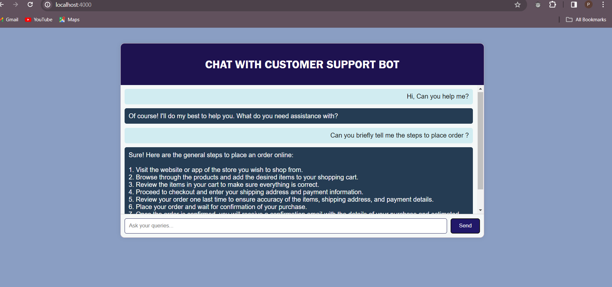
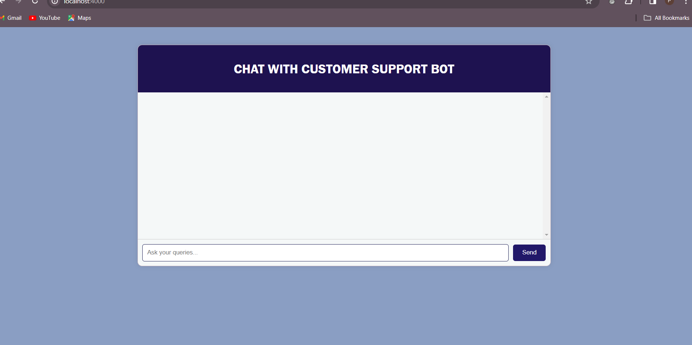

# Customer Support Bot

This project implements a simple customer support bot web application using HTML, CSS, JavaScript, and Node.js with Express. Users can interact with the bot by typing queries in the input box and receiving responses from the bot.


## Features

- **Chat Interface:** Users can type messages and interact with the bot in real-time.
- **Responsive Design:** Suitable for various screen sizes, ensuring a consistent experience across devices.
- **User-Friendly:** Easy-to-use interface for seamless interaction with the bot.

## Technologies Used

- **Frontend:**
  - HTML
  - CSS
  - JavaScript

- **Backend:**
  - Node.js
  - Express

- **External APIs:**
  - OpenAI API for natural language processing.

## Installation

1. **Clone the repository:**

    ```bash
    git clone https://github.com/yourusername/customer-support-bot.git
    ```

2. **Navigate to the project directory:**

    ```bash
    cd customer-support-bot
    ```

3. **Install dependencies:**

    ```bash
    npm install
    ```

4. **Start the server:**

    ```bash
    node server.js
    ```

5. **Open your web browser and visit [http://localhost:4000](http://localhost:4000) to access the chat interface.**


## Screenshots





## Usage

- Type your queries in the input box and press "Send" to send messages to the bot.
- The bot will respond with relevant answers displayed on the left side of the chat interface.

## Credits

- This project uses the OpenAI API for natural language processing.
- Developed by Priyadarshini S
